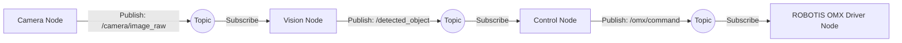

# ROS 2(Physical AI Tools) 설치 및 개념 정리

## 개요

이 문서는 Physical AI Tools(웹 UI)를 사용하여 ROBOTIS OMX를 설정하고 운영하기 위한 ROS 2 개념을 정리한 문서입니다.

ROBOTIS OMX 같은 로봇 시스템은 카메라, 센서, 모터, 로봇팔 제어 프로그램처럼 여러 기능이 동시에 작동합니다.
ROS 2는 이러한 기능들을 하나의 거대한 프로그램으로 합치는 것이 아니라, 기능별 프로그램을 나누고 서로 데이터를 주고받게 만들어 로봇 전체가 작동하도록 연결하는 역할을 합니다.

---

## 시스템 요구사항

| 항목         | 내용                         |
| ---------- | -------------------------- |
| 권장 운영체제    | Ubuntu                     |
| 하드웨어 요구 사항 | NVIDIA GPU(CUDA 지원)        |
| 컨테이너 내부 환경 | Ubuntu 24.04 + ROS 2 Jazzy |
| 호스트 운영체제   | 컨테이너와 버전이 반드시 일치할 필요는 없음   |

컨테이너는 Ubuntu 24.04와 ROS 2 Jazzy 환경을 실행합니다.
따라서 실제 PC의 Ubuntu 버전이 컨테이너 내부 Ubuntu 버전과 완전히 같을 필요는 없습니다.

다만 Docker, NVIDIA 드라이버, NVIDIA Container Toolkit은 호스트 PC에 설치되어 있어야 합니다.

---

## ROS 2란?

ROS 2는 로봇 내부의 여러 프로그램을 서로 연결해 주는 통신 시스템입니다.

로봇 안에는 다음과 같은 프로그램들이 따로 존재할 수 있습니다.

* 카메라 영상을 받아오는 프로그램
* 센서 데이터를 읽는 프로그램
* 로봇팔을 움직이는 프로그램
* 경로를 계산하는 프로그램
* 웹 UI에서 명령을 보내는 프로그램

ROS 2는 이 프로그램들이 서로 필요한 데이터를 주고받을 수 있도록 연결합니다.

쉽게 말하면 ROS 2는 로봇 내부 프로그램들의 신경망 역할을 합니다.

---

## ROS 2를 사용하는 이유

로봇 프로그램을 하나의 큰 코드로 만들면 수정과 관리가 어렵습니다.

예를 들어 카메라 코드, 모터 제어 코드, 로봇팔 제어 코드를 모두 한 파일에 넣으면 작은 오류가 전체 시스템에 영향을 줄 수 있습니다.

ROS 2를 사용하면 기능을 나누어 개발할 수 있습니다.

* 카메라 기능은 카메라 노드가 담당
* 로봇팔 제어는 제어 노드가 담당
* 웹 UI 명령은 별도의 명령 노드가 담당
* 각 노드는 토픽, 서비스, 액션으로 연결

이렇게 하면 각 기능을 독립적으로 개발하고 테스트할 수 있습니다.

---

## 핵심 개념

### 1. Node

노드는 기능별로 나누어진 독립적인 프로그램입니다.

예를 들어 ROBOTIS OMX를 제어하는 시스템에서는 다음과 같은 노드가 있을 수 있습니다.

* 카메라 노드
* 객체 인식 노드
* 로봇팔 제어 노드
* 웹 UI 명령 노드
* 모터 드라이버 노드

각 노드는 하나의 역할을 담당하고, 필요한 데이터만 다른 노드와 주고받습니다.

---

### 2. Topic

토픽은 노드들이 데이터를 주고받는 일방향 데이터 통로입니다.

예를 들어 카메라 노드는 현재 화면 데이터를 계속 발행할 수 있습니다.
객체 인식 노드는 그 카메라 토픽을 구독하여 화면 속 물체를 분석할 수 있습니다.

즉, 토픽은 계속 흐르는 데이터에 적합합니다.

예시:

* 카메라 영상
* 센서값
* 로봇 상태
* 모터 속도
* 관절 위치

---

## ROS 2 Topic 발행 구조

아래 그래프는 ROS 2에서 토픽이 어떻게 발행되고 구독되는지 보여줍니다.



이 구조에서 중요한 점은 노드들이 서로 직접 강하게 묶여 있지 않다는 것입니다.

카메라 노드는 객체 인식 노드가 누구인지 몰라도 됩니다.
카메라 노드는 `/camera/image_raw`라는 토픽에 영상 데이터를 계속 발행하기만 하면 됩니다.

객체 인식 노드는 그 토픽을 구독해서 필요한 데이터를 가져옵니다.

이러한 구조 덕분에 새로운 노드를 추가하거나 기존 노드를 수정해도 전체 시스템을 비교적 쉽게 유지할 수 있습니다.

---

## ROS 2 Topic 발행 과정 예시

ROBOTIS OMX에 카메라 기반 제어 기능이 있다고 가정하면 흐름은 다음과 같습니다.

1. Camera Node가 카메라 화면을 읽음
2. `/camera/image_raw` 토픽에 영상 데이터를 발행함
3. Vision Node가 해당 토픽을 구독함
4. Vision Node가 물체를 인식함
5. `/detected_object` 토픽에 인식 결과를 발행함
6. Control Node가 인식 결과를 구독함
7. Control Node가 로봇팔 동작 명령을 생성함
8. ROBOTIS OMX Driver Node가 명령을 받아 로봇팔을 움직임

즉, ROS 2에서는 데이터가 노드에서 노드로 직접 이동하는 것이 아니라, 토픽이라는 통로를 통해 이동합니다.

---

## Topic 확인 명령어

ROS 2 환경에서 현재 사용 중인 토픽을 확인하려면 다음 명령어를 사용할 수 있습니다.

```bash
ros2 topic list
```

특정 토픽에서 실제로 어떤 데이터가 흐르는지 확인하려면 다음과 같이 입력합니다.

```bash
ros2 topic echo /topic_name
```

예를 들어 카메라 토픽을 확인하려면 다음과 같이 사용할 수 있습니다.

```bash
ros2 topic echo /camera/image_raw
```

단, 카메라 영상처럼 데이터가 큰 토픽은 터미널에서 직접 출력하기에 적합하지 않을 수 있습니다.

---

## Node 확인 명령어

현재 실행 중인 노드를 확인하려면 다음 명령어를 사용합니다.

```bash
ros2 node list
```

특정 노드가 어떤 토픽을 발행하고 구독하는지 확인하려면 다음과 같이 입력합니다.

```bash
ros2 node info /node_name
```

이 명령어를 사용하면 해당 노드의 Publisher, Subscriber, Service, Action 정보를 확인할 수 있습니다.

---

## Service

서비스는 요청과 응답이 필요한 명령에 사용됩니다.

토픽은 데이터를 계속 흘려보내는 방식이지만, 서비스는 필요한 순간에 요청을 보내고 응답을 받는 방식입니다.

예를 들어 다음과 같은 상황에서 사용할 수 있습니다.

* 현재 로봇 상태를 한 번만 요청할 때
* 특정 설정값을 변경할 때
* 장치를 초기화할 때

서비스는 “요청 → 응답” 구조에 적합합니다.

---

## Action

액션은 시간이 오래 걸리는 명령에 사용됩니다.

예를 들어 로봇팔에게 “저 위치로 이동하라”라는 명령을 내리면, 이동이 즉시 끝나지 않습니다.
이때 액션을 사용하면 다음과 같은 정보를 주고받을 수 있습니다.

* 목표 명령
* 진행 상황
* 최종 결과

예시:

```text
명령: 목표 위치로 이동
응답: 명령을 받음
진행 상황: 이동 중
결과: 목표 위치에 도착
```

따라서 액션은 로봇 이동, 로봇팔 제어, 긴 작업 수행에 적합합니다.

---

## 정리

ROS 2는 로봇 내부의 여러 프로그램을 기능별 노드로 나누고, 토픽·서비스·액션을 통해 서로 연결하는 통신 시스템입니다.

ROBOTIS OMX와 같은 로봇 시스템에서 ROS 2를 사용하면 카메라, 센서, 제어 알고리즘, 모터 제어 프로그램을 각각 독립적으로 개발하면서도 하나의 로봇처럼 작동하게 만들 수 있습니다.
